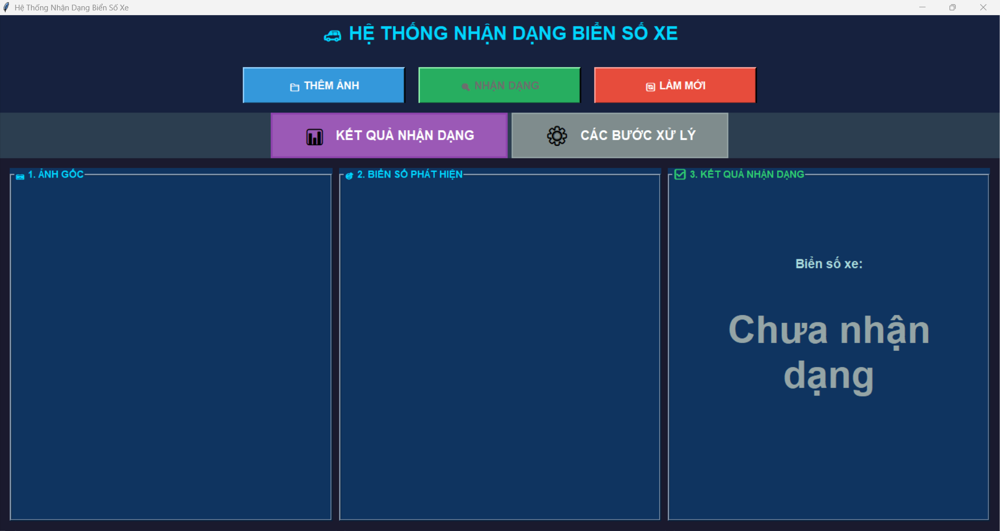
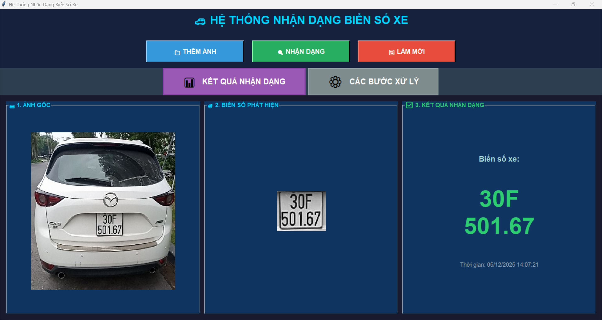
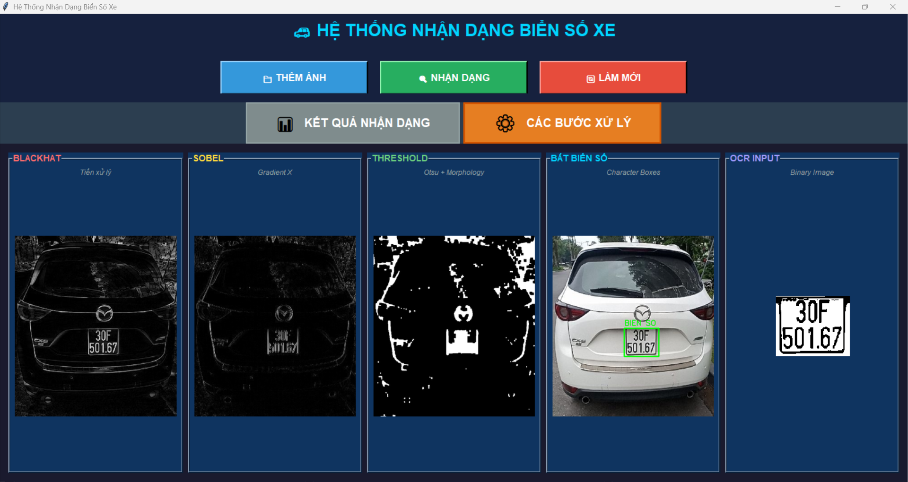

# 🚗 Vietnamese License Plate Recognition System

[](https://www.python.org/)
[](https://opencv.org/)
[](https://github.com/PaddlePaddle/PaddleOCR)
[](LICENSE)

A robust and efficient system for detecting and recognizing Vietnamese license plates using Computer Vision and Deep Learning techniques.

## 📋 Table of Contents

- [Features](#-features)
- [Demo Screenshots](#-demo-screenshots)
- [System Architecture](#-system-architecture)
- [Installation](#-installation)
- [Usage](#-usage)
- [Project Structure](#-project-structure)
- [Technical Details](#-technical-details)
- [Dataset](#-dataset)
- [Performance](#-performance)
- [Contributing](#-contributing)
- [License](#-license)
- [Contact](#-contact)

## ✨ Features

- ✅ **Multi-Vehicle Support**: Recognizes both motorcycle and car license plates
- ✅ **Dual Format Recognition**: Supports both old (4-digit) and new (5-digit) Vietnamese license plates
- ✅ **Real-time Processing**: Fast detection and recognition pipeline (~0.5-1.5s per image)
- ✅ **User-friendly GUI**: Built with Tkinter for easy interaction
- ✅ **Modular Architecture**: Clean separation of preprocessing, detection, segmentation, and OCR
- ✅ **Step-by-step Visualization**: View each processing stage
- ✅ **High Accuracy**: Powered by PaddleOCR with ~88% recognition accuracy

### Supported License Plate Formats

| Type | Format | Example |
|------|--------|---------|
| Motorcycle (Old) | NN-LL/NNNN | 59-B1/6482 |
| Motorcycle (New) | NN-LL/NNN.NN | 60-B8/010.75 |
| Car (Old) | NNL-NNNN | 29A-8195 |
| Car (New) | NNL-NNN.NN | 30E-435.02 |

*N = Number, L = Letter*

## 📸 Demo Screenshots

## 📸 Demo Screenshots

### Main Interface


### Recognition Results


### Processing Steps


### Processing Pipeline
View the complete processing pipeline:
1. Blackhat Transform
2. Sobel Gradient Detection
3. Threshold & Morphology
4. License Plate Detection
5. Character Segmentation & OCR

## 🏗️ System Architecture

```
┌─────────────┐
│ Input Image │
└──────┬──────┘
       │
       ▼
┌─────────────────────────────────────┐
│  MODULE 1: Image Preprocessing      │
│  - Blackhat Transform               │
│  - Sobel Gradient (Vertical Edges)  │
│  - Otsu Thresholding                │
│  - Morphological Operations         │
└──────────────┬──────────────────────┘
               │
               ▼
┌─────────────────────────────────────┐
│  MODULE 2: License Plate Detection  │
│  - Contour Detection                │
│  - Aspect Ratio Filtering           │
│  - Dual-mode Detection              │
│  - Plate Region Extraction          │
└──────────────┬──────────────────────┘
               │
               ▼
┌─────────────────────────────────────┐
│  MODULE 3A: Character Segmentation  │
│  - Vertical Projection Analysis     │
│  - Valley Detection                 │
│  - Character Boundary Detection     │
└──────────────┬──────────────────────┘
               │
               ▼
┌─────────────────────────────────────┐
│  MODULE 3B: OCR Recognition         │
│  - PaddleOCR Engine                 │
│  - Multi-line Support               │
│  - Text Post-processing             │
│  - Format Validation                │
└──────────────┬──────────────────────┘
               │
               ▼
       ┌───────────────┐
       │ Recognized Text│
       └───────────────┘
```

## 🔧 Installation

### Prerequisites

- Python 3.8 or higher
- pip package manager
- Git (optional)

### Step 1: Clone the Repository

```bash
git clone https://github.com/theshy2511/license-plate-recognition.git
cd license-plate-recognition
```

Or download ZIP and extract.

### Step 2: Create Virtual Environment (Recommended)

**Windows:**
```bash
python -m venv venv
venv\Scripts\activate
```

**Linux/Mac:**
```bash
python3 -m venv venv
source venv/bin/activate
```

### Step 3: Install Dependencies

```bash
pip install -r requirements.txt
```

### Step 4: Run the Application

```bash
cd Code
python main.py
```

## 📦 Dependencies

```
opencv-python>=4.8.0
numpy>=1.24.0
pillow>=10.0.0
paddlepaddle>=2.5.0
paddleocr>=2.7.0
imutils>=0.5.4
```

## 🚀 Usage

### GUI Application

1. **Launch the application:**
   ```bash
   python main.py
   ```

2. **Upload an image:**
   - Click "THÊM ẢNH" (Add Image)
   - Select an image containing a license plate

3. **Process the image:**
   - Click "NHẬN DẠNG" (Recognize)
   - Wait for processing (~0.5-1.5 seconds)

4. **View results:**
   - **Tab 1 (KẾT QUẢ NHẬN DẠNG)**: See the original image, detected plate, and recognized text
   - **Tab 2 (CÁC BƯỚC XỬ LÝ)**: View the 5-step processing pipeline

5. **Reset:**
   - Click "LÀM MỚI" (Reset) to start over

### Programmatic Usage

```python
from pipeline import LicensePlatePipeline

# Initialize pipeline
pipeline = LicensePlatePipeline()

# Process single image
result = pipeline.process('path/to/image.jpg')

# Access results
print(f"License Plate: {result['text']}")
print(f"Confidence: {result['plate_info']['confidence']}")
print(f"Characters Found: {result['character_count']}")
```

### Batch Processing Example

```python
import os
from pipeline import LicensePlatePipeline

pipeline = LicensePlatePipeline()
input_folder = 'Dataset/xe_may/bien_cu'
output_file = 'results.txt'

with open(output_file, 'w', encoding='utf-8') as f:
    for img_file in os.listdir(input_folder):
        if img_file.endswith(('.jpg', '.png')):
            img_path = os.path.join(input_folder, img_file)
            result = pipeline.process(img_path)
            f.write(f"{img_file}: {result['text']}\n")
            print(f"Processed: {img_file} -> {result['text']}")
```

## 📁 Project Structure

```
license-plate-recognition/
│
├── Code/
│   ├── main.py                      # Main GUI application
│   ├── pipeline.py                  # Processing pipeline orchestrator
│   ├── config.py                    # Configuration & constants
│   ├── person1_preprocessing.py     # Image preprocessing module
│   ├── person2_detection.py         # License plate detection
│   ├── person3_segmentation.py      # Character segmentation
│   ├── person3_recognition.py       # OCR recognition module
│   └── gui_components.py            # GUI helper functions
│
├── Dataset/
│   ├── xe_may/                      # Motorcycle plates
│   │   ├── bien_cu/                 # Old format (4-digit)
│   │   └── bien_moi/                # New format (5-digit)
│   └── oto/                         # Car plates
│       ├── bien_cu/                 # Old format
│       └── bien_moi/                # New format
│
├── .gitignore                       # Git ignore rules
├── requirements.txt                 # Python dependencies
├── README.md                        # This file
├── LICENSE                          # MIT License
└── CONTRIBUTING.md                  # Contribution guidelines
```

## 🔬 Technical Details

### Module 1: Image Preprocessing

**Purpose:** Enhance license plate regions and suppress background noise.

**Techniques:**
1. **Blackhat Transform** (Morphological)
   - Kernel: 21×5
   - Enhances dark characters on light background

2. **Sobel Gradient** (Edge Detection)
   - Direction: X-axis (vertical edges)
   - Highlights character boundaries

3. **Otsu Thresholding** (Binarization)
   - Automatic threshold selection
   - Converts to binary image

4. **Morphological Closing**
   - Kernel: 10×10
   - Connects nearby components

**Code Reference:** `person1_preprocessing.py`

### Module 2: License Plate Detection

**Detection Strategy:**
- Dual-mode approach (Strict & Loose)
- Contour-based detection
- Shape validation using aspect ratio and solidity

**Aspect Ratio Thresholds:**
| Vehicle Type | Min Ratio | Max Ratio |
|--------------|-----------|-----------|
| Motorcycle   | 0.6       | 2.0       |
| Car          | 2.5       | 6.0       |

**Additional Filters:**
- Area threshold: 500 - 200,000 pixels
- Solidity: > 0.5 (compactness measure)

**Code Reference:** `person2_detection.py`

### Module 3A: Character Segmentation

**Method:** Vertical Projection Profile Analysis

**Steps:**
1. Compute column-wise pixel sum
2. Detect valleys (character boundaries)
3. Extract bounding boxes for each character
4. Filter based on size and position

**Visualization:** Green rectangles around detected characters

**Code Reference:** `person3_segmentation.py`

### Module 3B: OCR Recognition

**Engine:** PaddleOCR v2.7+

**Configuration:**
```python
PaddleOCR(
    use_angle_cls=True,    # Enable angle classification
    lang='en',             # English character set
    show_log=False         # Suppress verbose logs
)
```

**Post-processing:**
1. Character whitelist filtering (A-Z, 0-9, -, ., /)
2. Newline preservation (two-line plates)
3. Confidence thresholding
4. Format validation

**Code Reference:** `person3_recognition.py`

## 📊 Dataset

### Dataset Structure

```
Dataset/
├── xe_may/
│   ├── bien_cu/        # 100+ images
│   └── bien_moi/       # 80+ images
└── oto/
    ├── bien_cu/        # 100+ images
    └── bien_moi/       # 80+ images
```

### File Naming Convention

**Format:** `{PROVINCE}{LETTER}_{DIGITS}.jpg`

**Examples:**
- `59B1_6482.jpg` → 59-B1/6482
- `29A_8195.jpg` → 29A-8195
- `60B8_010.75.jpg` → 60-B8/010.75

### Image Requirements

- **Resolution:** Minimum 300×200 pixels
- **Format:** JPG, PNG, BMP
- **Plate Size:** Should occupy 30-50% of image
- **Lighting:** Various conditions (day/night)
- **Angle:** Front-facing (±15° tolerance)

## 🎯 Performance

### Accuracy Metrics

| Metric | Value |
|--------|-------|
| Detection Accuracy | ~92% |
| Recognition Accuracy | ~88% |
| Processing Time | 0.5-1.5s per image |
| Character Accuracy | ~94% |

*Tested on Intel i5 CPU, 8GB RAM, no GPU*

### Known Limitations

- **Poor lighting:** May affect detection
- **Extreme angles:** > 30° may fail
- **Damaged plates:** Scratches/dirt reduce accuracy
- **Non-standard plates:** Diplomatic/military not supported

### Future Improvements

- [ ] GPU acceleration support
- [ ] Custom deep learning model
- [ ] Support for damaged plates
- [ ] Video stream processing
- [ ] REST API development

## 🤝 Contributing

Contributions are welcome! Please follow these guidelines:

### How to Contribute

1. **Fork the repository**
2. **Create a feature branch:**
   ```bash
   git checkout -b feature/AmazingFeature
   ```
3. **Make your changes**
4. **Commit with clear message:**
   ```bash
   git commit -m "Add: Brief description"
   ```
5. **Push to your fork:**
   ```bash
   git push origin feature/AmazingFeature
   ```
6. **Open a Pull Request**

### Coding Standards

- Follow PEP 8 style guide
- Add docstrings to functions
- Include type hints where applicable
- Write unit tests for new features
- Update documentation

### Reporting Issues

Please include:
- Bug description
- Steps to reproduce
- Expected vs. actual behavior
- Screenshots (if applicable)
- Environment (OS, Python version)

See [CONTRIBUTING.md](CONTRIBUTING.md) for details.

## 📝 License

This project is licensed under the MIT License - see the [LICENSE](LICENSE) file for details.

```
MIT License

Copyright (c) 2025 theshy2511

Permission is hereby granted, free of charge, to any person obtaining a copy
of this software and associated documentation files (the "Software"), to deal
in the Software without restriction, including without limitation the rights
to use, copy, modify, merge, publish, distribute, sublicense, and/or sell
copies of the Software, and to permit persons to whom the Software is
furnished to do so, subject to the following conditions:

The above copyright notice and this permission notice shall be included in all
copies or substantial portions of the Software.

THE SOFTWARE IS PROVIDED "AS IS", WITHOUT WARRANTY OF ANY KIND, EXPRESS OR
IMPLIED, INCLUDING BUT NOT LIMITED TO THE WARRANTIES OF MERCHANTABILITY,
FITNESS FOR A PARTICULAR PURPOSE AND NONINFRINGEMENT.
```

## 🙏 Acknowledgments

- **PaddlePaddle Team** - For the excellent PaddleOCR framework
- **OpenCV Community** - For comprehensive computer vision tools
- **Vietnamese Traffic Police** - For license plate format specifications
- **Open Source Community** - For inspiration and support

## 📞 Contact

**Project Maintainer:** theshy2511

- GitHub: [@theshy2511](https://github.com/theshy2511)
- Repository: [license-plate-recognition](https://github.com/theshy2511/license-plate-recognition)

## 🗺️ Roadmap

### Version 1.1 (Planned)
- [ ] Add GPU acceleration (CUDA support)
- [ ] Improve accuracy for damaged plates
- [ ] Add confidence threshold settings
- [ ] Export results to CSV/JSON

### Version 2.0 (Future)
- [ ] Video stream processing
- [ ] REST API for web integration
- [ ] Database integration
- [ ] Custom deep learning model
- [ ] Mobile app (Android/iOS)
- [ ] Cloud deployment support

## 📚 References

1. [PaddleOCR Documentation](https://github.com/PaddlePaddle/PaddleOCR)
2. [OpenCV Documentation](https://docs.opencv.org/4.x/)
3. [Vietnamese License Plates - Wikipedia](https://en.wikipedia.org/wiki/Vehicle_registration_plates_of_Vietnam)
4. [Morphological Transformations](https://docs.opencv.org/4.x/d9/d61/tutorial_py_morphological_ops.html)
5. [Sobel Edge Detection](https://en.wikipedia.org/wiki/Sobel_operator)

---

**⭐ If you find this project useful, please give it a star!**

**Made with ❤️ in Vietnam 🇻🇳**
